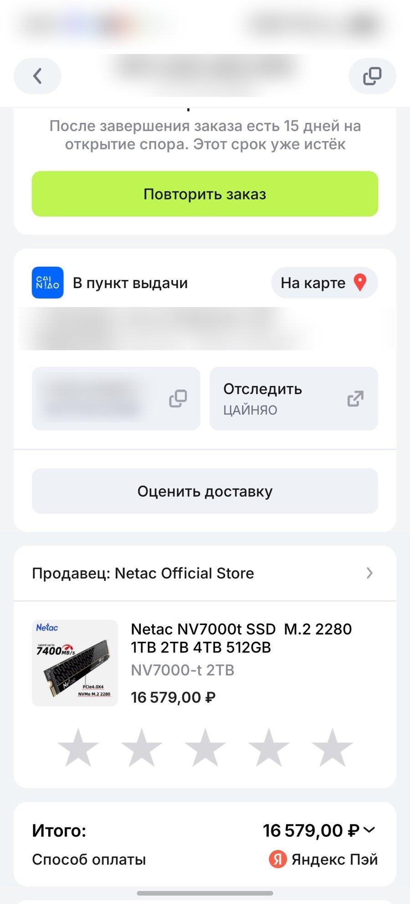
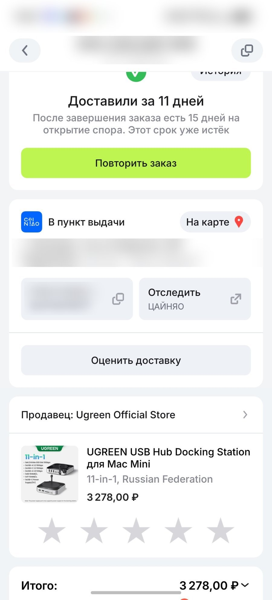
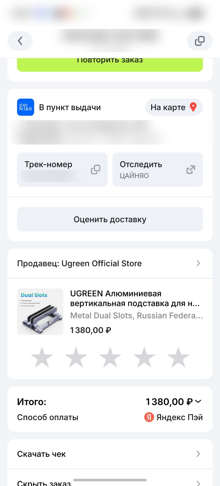
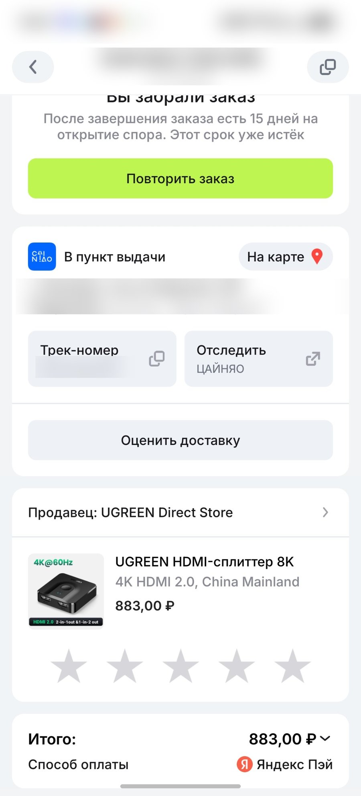

<!--
СТАТУС: ЧЕРНОВИК, НЕ ОПУБЛИКОВАН (ни сайт, ни Дзен, ни Telegram). Ждёт согласования текста и фото автором.
Источник: реальный опыт автора, см. EXPERIENCE.md, раздел 6–7. Текст сохранён как прислан, без правок.
Изображения: images/drafts/ssd-upgrade/ (скриншоты заказов; на них заблюрены статус-бар, номер заказа, адрес пункта выдачи и трек-номера).
Raw-база для Дзен: https://raw.githubusercontent.com/lebserval-art/lebserval-art.github.io/master/images/drafts/ssd-upgrade/
Порядок фото: order-netac-2tb.jpg → order-ugreen-dock.jpg → order-ugreen-stand.jpg → order-ugreen-switch.jpg
ПРОВЕРИТЬ до публикации:
 - «80 000 ₽ у Apple» в заголовке/тексте — цена апгрейда до 2 ТБ не подтверждена, сверить с apple.com/ru или смягчить формулировку.
 - «AliExpress» в смете: на скриншотах доставка Cainiao, оплата Яндекс Пэй — сверить формулировку.
 - Скорость «до 7400 МБ/с» — заявлена производителем (по карточке товара); через док/Type-C реальная будет ниже.
 - Ссылки на товары не проставлены: нужны партнёрские (Admitad) с erid и плашками «Реклама».
 - Скриншоты заказов на сайте/в Дзене — решить, показывать ли (анонимность: вырезать/блюрить любые данные пункта выдачи и заказа).
-->

# Апгрейд Mac mini за 22 000 ₽ вместо 80 000 ₽ у Apple: опыт с быстрым SSD на 2 ТБ и доком Ugreen

Когда покупаешь базовый Mac mini (16/256), интернет услужливо подсовывает сотни видео с заголовками: «256 ГБ — это приговор», «Внешние диски отваливаются», «Док-станции греют процессор».

Apple за заводской апгрейд накопителя до 2 ТБ требует доплату, сравнимую со стоимостью ещё одного компьютера. Я пошел прагматичным путём: взял базовый миник, док-станцию Ugreen и быстрый NVMe-накопитель. 

Показываю реальные чеки, цифры и то, как эта связка ведёт себя в режиме 24/7.

### Смета апгрейда: во сколько это обошлось на самом деле
Все позиции отслеживались и брались на распродажах AliExpress:
- SSD M.2 NVMe Netac NV7000-t на 2 ТБ: 16 579 ₽. Скорости до 7400 МБ/с (PCIe 4.0), официальный магазин. Самый выгодный и адекватный вариант по соотношению цена/скорость.
- Док-концентратор Ugreen 11-in-1 под Mac mini: 3 278 ₽. Ставится снизу подставкой со слотом M.2, кардридером и передними портами.
- Алюминиевая вертикальная стойка Ugreen под ноутбук: 1 380 ₽.
- Двунаправленный HDMI-свитч Ugreen: 883 ₽.

Итого: 22 120 ₽ за 2 терабайта быстрого хранилища и полную организацию стола.

### Реальность без прикрас: температуры, сон и отвалы
- Нагрев и шум: Накопитель тяжелыми многочасовыми бенчмарками пока не жарился, но в стандартной работе корпус чуть теплый благодаря комплектной термопрокладке. Вентилятор Mac mini не слышно вообще — тишина круглосуточная.
- Отвалы диска: На форумах жалуются на ошибки при выходе из сна. У меня Mac mini работает как серверная машина: 24/7 крутит чат-бота для бизнеса и служебные процессы. Компьютер просто не уходит в глубокий сон — гаснет только монитор. Итог: ни одного отвала накопителя.
- Распределение памяти: Внутренние 256 ГБ отданы под систему и ключевой софт. На внешние 2 ТБ без проблем встала библиотека игр Steam и тяжелые файлы — всё грузится быстро и без задержек.
